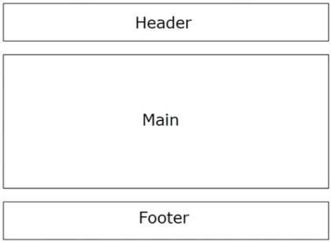

# 완성된 웹 사이트로 배우는 html css 웹 디자인 

## chap1. 웹 사이트의 기본과 필수 도구
###  웹 사이트 만드는 순서
1) 웹 사이트 기획 : 목적과 사용자
2) 사이트 맵 작성 
3) 디자인 : 디자인 샘플 작업 (포토샵, 일러스트, 피그마 등등)
4) 코드 작성 : html, css, js
5) 웹 공개

### css 파일 초기화 방법
1) https://nicolas-cusan.github.io/destyle.css/
2) https://meyerweb.com/eric/tools/css/reset/
3) https://necolas.github.io/normalize.css/

## chap2. 랜딩페이지로 배우는 반응형 웹 디자인과 글꼴 
### 1단 레이아웃 
: 단을 여러개 사용하지 않고, 하나의 단으로 작성한 레이아웃 (단 = 열)


### 실습. 풀 사이즈 배경 이미지로 눈에 띄는 디자인 만들기     
 : Tip 1. 배경 이미지의 가로폭은 1200px ~ 3000px을 사용하는 것이 좋다.    
 : Tip 2. 배경 이미지의 용량을 줄 일 수 있는 사이트 주소 
1) https://shrinkme.app/
2) https://compressor.io/

: 1. 배경이미지 여러 개 지정하기 
=> background의 url을 가져올 이미지 개수 만큼 사용

: 2. 배경이미지를 표시할 위치를 변경 
=> background-position 속성을 이용  

### 웹 폰트 
: 어떤 환경에서 웹 페이지에 접속하든 상관없이 설정한 글꼴로 표시    

: 추천 사이트 
|사이트 이름|주소|
|---|---|
|구글 폰트 | https://fonts.google.com/?subset=korean|
|어도비 폰트 | https://fonts.adobe.com/?locale=ko |
|TypeSquare | https://typesquare.com/ko/ |
|DaFontt | https://www.dafont.com/ |
|눈누 | https://noonnu.cc/ |
|공유마당 | https://gongu.copyright.or.kr/gongu/main/main.do |
|네이버 나눔글꼴 | https://hangeul.naver.com/font |
|산돌구름 | https://www.sandollcloud.com/ |

: 같은 글꼴 내에서 조합을 하는 것이 좋으며 (font-family), 제목 본문의 굵기, 글자 크기를 다르게 적용하는 것을 추천

### 고해상도 이미지를 사용할 수 없을 때의 Tip
1) 이미지를 흐릿하게 한다. 
2) 정무늬 입히기
3) 줄무늬 겹치기 
 
### 아이콘폰트 
: 웹 페이지에서 글자처럼 표시되는 아이콘으로, 확대 축소해도 화질이 떨어지지 않음 

: fontawesome   
https://fontawesome.com/

### 반응형 웹 디자인 
: 디바이스 별로 HTML을 작성하지 않고, CSS로 꾸밀 수 있어서 웹 사이트를 더운 쉽게 업데이트하고 관리   

: Viewport 설정   
-  viewport를 설정하지 않으면 스마트폰으로 봐도 데스크톱 화면처럼 크게 나옴    
- head 안에 <meta> 태그를 입력해 가로 폭을 각 디바이스에 맞춤    
    `<meta name="viewport" content="width=device-width, initial-scale=1.0">`    
    : width=device-width는 디바이스의 가로 폭에 맞춰 보여주세요     
    : initial-scale은 페이지를 확대하는 비율을 나타내는 값으로 1로 설정하면 확대없이 본래 크기로 보여주세요를 의미

: 미디어 쿼리 
   - 화면 크기만 디바이스에 맞출 뿐이고, 레이아웃은 최적화 되지 않는데, 이 최적화를 위해 css로 세세하게 설정해야 하는데, 이때 미디어 쿼리를 사용함 
   - 적용하는 방법
   1. css 파일로 적용하는 방법      
   ```
    @media (max-width: 700px) {
        .title {
            font-size: 4rem;
        }
        p {
            padding: 0 1rem;
        }
        p,
        .menu-list li {
            font-size: 1rem;
        }
        .hero {
            padding-top: 12vh;
        }
    }
   ```

   2. css 파일은 불러오는 `<link>` 태그로 적용하는 방법   
   ```
        <link rel="stylesheet" href="desktop.css" media = "(min-width: 701px)">
        <link rel="stylesheet" href="mobile.css" media = "(max-width: 700px)">
   ```

   3. css 파일은 @import로 불러오는 방법 
   ```
        @import url('mobile.css')(max-width: 700px);
   ```

: 모바일 퍼스트와 데스크톱 퍼스트    
- 모바일 퍼스트    
: 모바일에서 어떻게 표현할 것인지 먼저 정의하고, 데스크톱용 화면을 미리어 쿼리로 적용하는 방법    
: 미디어 쿼리를 min-width를 설정해 최소폭을 지정   

### SVG 형식 이미지로 바비콘 만들기 
: 파비콘이란 웹 페이지 탭에 표시되는 아이콘
: SVG 형식 사용시, 확대 축소를 해도 깨지지 않음 

### 브레이크 포인트 
: 미디어 쿼리를 사용해 디바이스별로 적용하는 css를 나누는 분기점    
: 예를 들어 min-width : 700px 이면, 700px이 브레이크 포인트     
: 반응형 웹 디자인을 적용한 사이트 참고 
- RWDB : http://rwdb.kr/


### 표시 영역으로 빠르게 이동하는 방법 
: css 스크롤 스냅 
- 페이지를 스크롤할 때 보여주고 싶은 영역에 멈추게 하는 기능 
- 스크롤할 영역을 부모요소인 .container로 감싸준다. 
- 부모 요소 영역을 다음과 같이 설정을 해 준다. 

    ```
    .container {
        overflow: auto;
        scroll-snap-type: y mandatory;
        height: 100vh;
    }
    ```

    => scroll-snap-type은 스크롤 하는 축을 설정 x(가로), y(세로)를 지정할 수 있으며, 스크롤하는 방향에 따라 어느 정도의 수준으로 위치를 조정도  mandatory, proximity로 설정할 수 있음.     
 
    
    ```
    .area {
        /* 스크롤 스냅 설정 */
        scroll-snap-align: start;
    }
    ```
    => 부모 요소의 어느 위치에서 멈출지를 설정 


## chap3. 블로그 사이트로 배우는 다단 레이아웃과 꾸미는 방법 
### 2단 레이아웃 
: 좌우 너비를 다르게 설정해 넓은 쪽에 메인 콘텐츠를, 좁은 쪽에 내비게이션 메뉴 등을 두어 메인 영역과 서브 영역으로 나누는 방법이 있음       

- 장점   
: 웹 사이트 내 사용자의 편의성 상습   
: 높은 공간 활용도   

- 주의해야 할 점   
:  메인 콘텐츠에 대한 떨어지는 집중력    
: 작은 화면에서 읽기 어려움 (모바일 디바이스에서는 1단으로 전환하도록 구성)

- 2단으로 구성된 웹사이트    
https://typecode.com/ 

### 다양한 레이아웃
1. 타일형 레이아웃
2. 모자이크 레이아웃
3. 다단 레이아웃
4. 프리 레이아웃

### 크기가 다른 화면에도 대응할 수 있는 전환 방법
1. 화면 크기에 맞춘 레이아웃 변경 
- 모바일 사이즈 개발 (1단 레이아웃)
- 데스크톱 사이즈 개발  (2단 레이아웃)

### 좋은 디자인이 떠오르지 않을 때 도움이 되는 사이트   
- 마네루 디자인 연구소   
https://maneru-design-lab.net/page/2  

- Design Patterns      
https://ui-patterns.com/patterns 

### position 속성으로 위치 지정하기 
1. 상대 위치를 정하는 값 relative    
: 원래 보여줘야 하는 위치를 기준으로 상대적인 위치를 결정

2. 절대 위치를 정하는 값 absolute   
: 부모 요소를 기준으로 절대위치를 정하는 것 
: 원래 위치는 무시하고 주위에 어떤 요소나 여백과 상관없이 반드지 지정한 위치에 배치   
: 부모 요소에 position : relative를 설정해야 해당 부모 요소를 기준으로 설정할 수 있음. 만약에 없으면 브라우저 화면을 기준으로 범위를 정함    

### 가상요소 
: HTML에서 정의되지 않응 요소를 CSS로 새롭게 만들어낸 요소    
: 사용하는 방법은 ::before나 ::after를 붙여 content 속성과 조합한 후 가상 요소를 만듬     
: content 속성으로 표시한 텍스트는 선택 및 복사, 붙여넣기를 할 수 없음   
|::before|::after|
|---|---|
|요소의 앞에 가상요소 삽입|요소의 뒤에 가상요소 삽입|


### 블로그 사이트 만들기 
**1. 제목, 이미지, 버튼 꾸미기**   
- 제목에 줄무늬가 들어간 밑줄 넣기 

    ```
    .post-title {
        padding-bottom: 10px;
        background-image: linear-gradient(45deg, #fff 30%, #ccc 30%, #ccc 50%, #fff 50%, #fff 80%, #ccc 80%, #ccc 100%);
    background-size: 6px 6px;
    margin-bottom: 1.5rem;
    }   
    ```

- 이미지 꾸미기    
: 텍스트를 원형 이미지에 맞춰 배치하기    
=> **css shapes**를 사용하면 원형, 다각형 또는 이미지 형태에 맞춰서 텍스트를 감싸듯이 배치할 수 있음 

    ```
        .post-thumb {
            margin: 0 1rem 1rem 0;
            shape-outside: circle();
            float: left;
        }
    ```

- 버튼 꾸미기 
    ```
    .btn a {
        box-shadow: 0 0 0 5px #eda1a1;
        border: 2px dashed #e38787;
    }
    ```
    => box-shadow : 가로방향그림자위치 세로방향그림자위치 그림자흐릿정도 그림자크기 그림자색;

**2. 번호 없는 목록, 번호 있는 목록** 
- 번호 없는 목록    
: 목록을 만들면 각 항목 왼쪽에 원형의 글머리 기호가 붙는데, 이 글머리 기호는 list-style로 꾸밀 수 없음.    
: 변경하려면 ::before로 가상요소를 만들어야 함 
: 커스터마이징 할때 fontawesome의 아이콘을 사용할 수 있음

- 번호 있는 목록 꾸미기    
: 가상 요소를 사용하는데, 커스텀 시 counter-increment라는 속성을 이용해야 함.    
    ```
    article ol li {
        counter-increment: list;
    }
    article ol li::before {
        content: counter(list);
        color: #93d8d0;
        display: inline-block;
        margin-right: 8px;
    }
    ```

    => counter-increment는 요소의 연속 값을 세는 속성으로 웹 페이지에서 사용할 때마자 값의 숫자가 늘어남.    
    => counter-increment 값에 임의의 카운더명을 설정하고, li::before에 앞서 content 속성에 지정한 카운터명을 넣어 요소의 개수를 표시  

**3. 인용문, 페이지네이션, 테두리** 
- 인용문 꾸미기    
: 인용문은 `<blockquote>` 태그로 감쌉니다.      
: 홑낫표나 따옴표 포인트 줄 때 사용 

- 페이지네이션 꾸미기   
: 블로그, 공지 등 게시물이 많은 경우 페이지를 분할할 때 사용

- 테두리 꾸미기    
: 콘텐츠를 하나로 모아서 보여주고 싶을 때 사용   

**4. 헤터, 푸터, 내비게이션, 표, 폼**
- 헤더 꾸미기   
: 로고나 내비게이션을 두는 경우가 많음    

- 푸터   
: 저작권 문구부터 페이지별 링크, 문의처 등을 배치하는 경우 많음      

- 내비게이션  
: 사용자가 원하는 콘텐츠를 빨리 찾을 수 있도록 하는 메뉴 

- 표   
: 가격표, 회사개요, 시간표 등에 표를 사용   

- 폼  
:  사용자가 끝까지 입력하고 전송하도록 하는 것 

**5. 스트롤에 맞춰 따라오기**     
: 세로로 긴 웹 페이지에서 항상 표시하고 싶은 요소가 있다면 상자를 스크롤에 맞춰 따라오게 해 사용자를 유도할 수 있음     
: `position : sticky` 속성을 이용 

